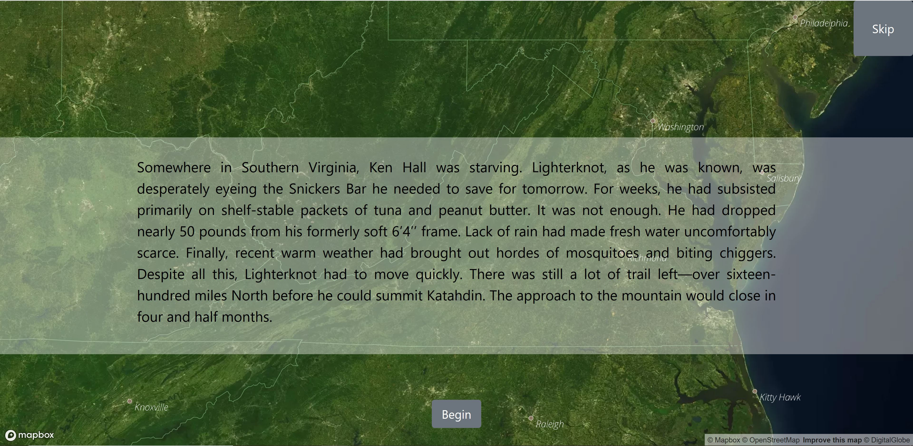

# [Appalachian Trail Map and Story](https://aaronbrezel.github.io/Appalachian-Trail-Map/)

## Purpose 

In the late fall of 2018, interviewed a series of Appalachian Trail thru-hikers for a story on the mental challenges of walking the trail. This project was for a writing-intensive class at Columbia University's Graduate School of Journalism. My completed work, "Tougher than a Lighterknot," focused on experiences of one man.

That winter, I decided to experiment with using browser animations to augment the reading experience. I began by storyboarding a few potential introductions eventually settling on the presentation you see now. This is a proof of concept and a final product should involve more animation, map and multimedia work -- especially beyond the introduction and especially improving the responsive web design.    

## Static results

Here, you can see what the opening card of the webpage:

## Resources

The map was assembled using [Mapbox Studio](https://www.mapbox.com/mapbox-studio/) and the map animations were performed using Mapbox's [JavaScript api](https://docs.mapbox.com/mapbox.js/api/v3.2.1/).

GIS data for the trail is provided by the [Appalachian Trail Conservancy](http://appalachiantrail.org/home/explore-the-trail/gis-data). 

GIS data was downloaded and then converted to a geoJSON file format using [MyGeodata](https://mygeodata.cloud/converter/shp-to-geojson "MyGeodata")

Webpage layout relyed on [Bootstrap CSS 4.2.1](https://getbootstrap.com/).

Page animations were done using Greensock's [GSAP library](https://greensock.com/docs/). 
